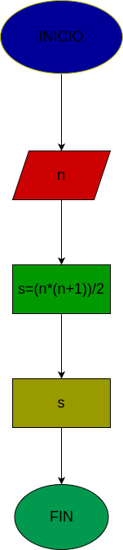

# Suma_n_Numeros
Suma de los n primeros números naturales

# Análisis

## Input
### Variables de entrada

n: número que se decida aplicar la fórmula

### processing
s:
s=(n*(n+1))/2

### Output
s
# Diseño
"diagrama de flujo"

# construcción
